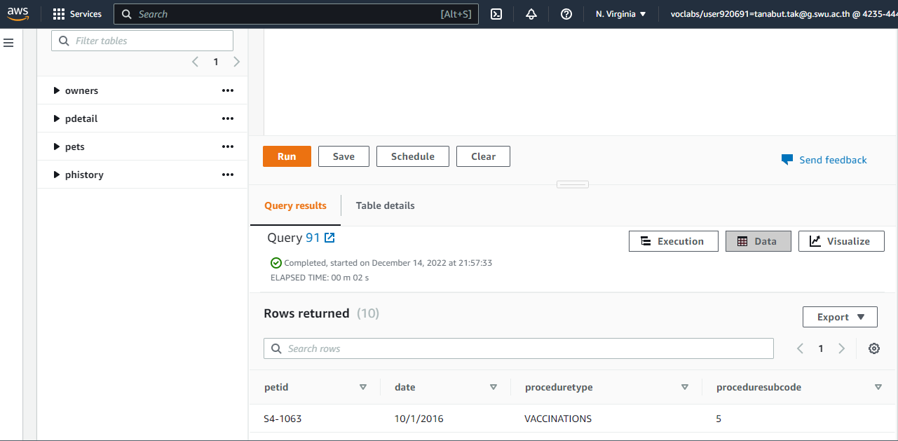
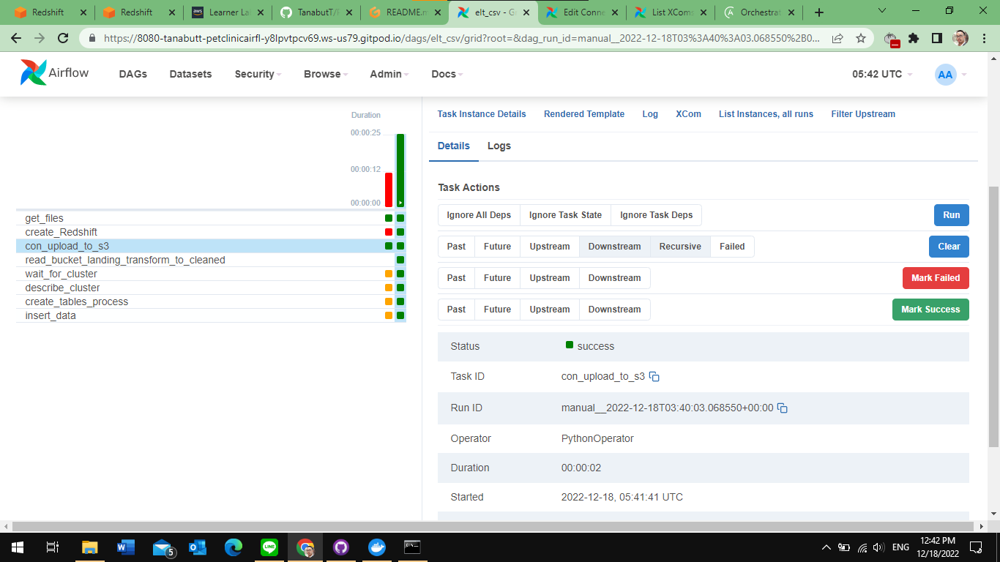
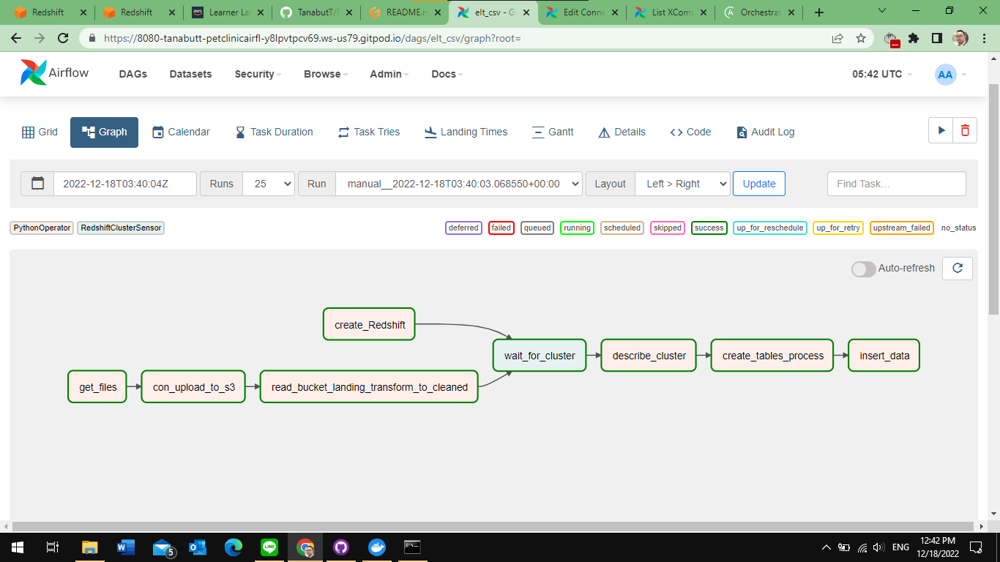
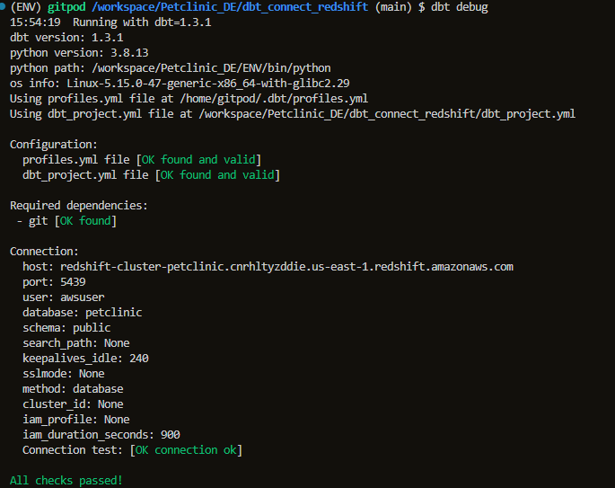
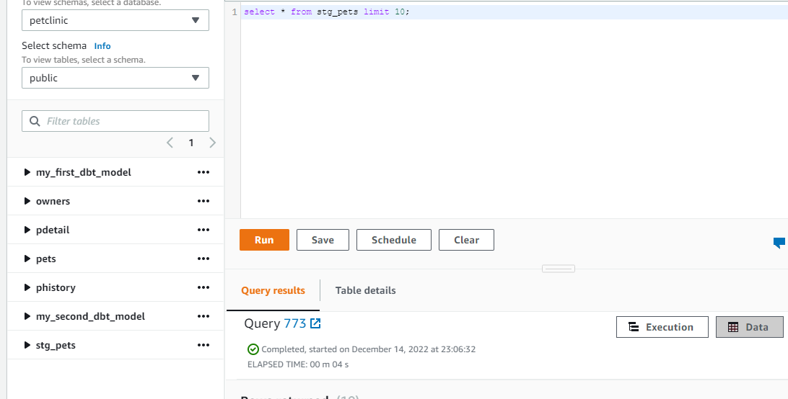
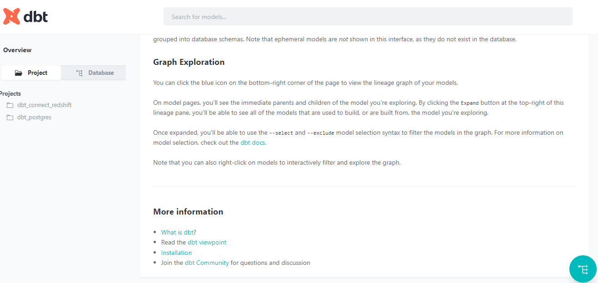
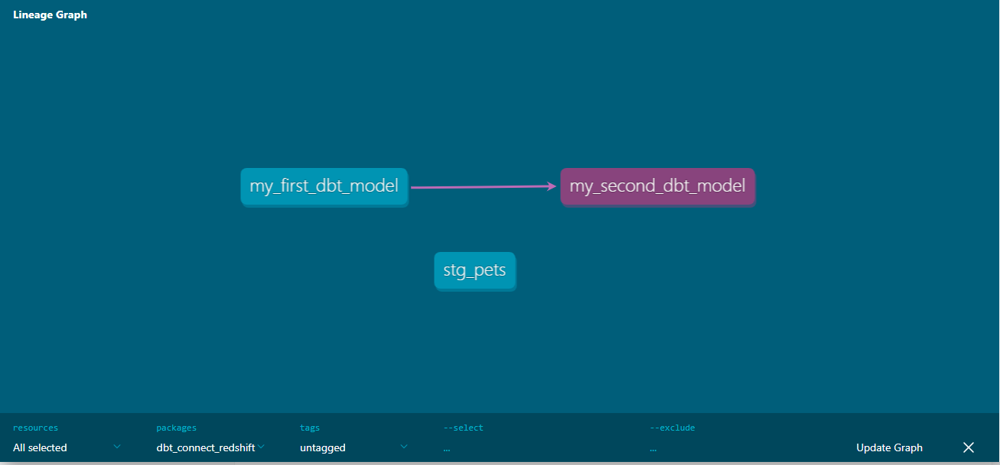

# Capstone Project Data Engineer

## Getting Started linux
ENV is name of virtual environment can name up to user 
example CUTECAT then 
source CUTECAT/bin/active
```sh
python -m venv ENV
source ENV/bin/activate
pip install -r requirements.txt
```
## Creating and Scheduling Data Pipelines

ถ้าใช้งานระบบที่เป็น Linux ให้เรารันคำสั่งด้านล่างนี้ก่อน
Check ดูว่ามี folder dags อยู่แล้วหรือไม่ ถ้าไม่มีรัน 
```sh
mkdir -p ./dags ./logs ./plugins
echo -e "AIRFLOW_UID=$(id -u)" > .env
```
-for window
```sh
mkdir ./dags 
mkdir ./logs 
mkdir ./plugins
```  
สร้าง .env file ขึ้นมา ถ้ายังไม่มี (directory เดียวกับ docker-compose.yaml) แล้วใส่ค่านี้ลงไป
โดยให้เปิด wsl ของ ubuntu แทนเพื่อนเอาค่า $(id -u)
```sh 
echo -e "AIRFLOW_UID=$(id -u)" > .env
```

### Access AWS cli
* FIrst of all get:
  - aws_access_key_id = "xxxxxxxxxxxxxxxxxx"
  - aws_secret_access_key = "xxxxxxxxxxxxxxxxxx"
  - aws_session_token = "xxxxxxxxxxxxxxxxxx"
with the command here
```sh 
cat ~/.aws/credentials
```
ต่อมาสร้าง ไฟล์ settings_dags.py เพิ่มดูตัวอย่างจาก [settings_dags_template.py](./dags/settings_dags_template.py)

### docker build ให้ Airflow มี s3fs เพื่อต่อกับ AWS S3 file system ได้ 
```sh
docker build . --tag extending_airflow
```

หลังจากนั้นให้รัน

```sh
docker-compose up -d
```
open browser on port 8080 to access Airflow webservice  

### Add connection profile in Airflow
- go to tab Admin
- choose connnection
- Add new connection  
```sh
Connection ID: redshift_petclinic
Connection Type: Amazon Redshift
Host: <your-redshift-endpoint> (for example, redshift-cluster-petclinic.cnrhltyzddie.us-east-1.redshift.amazonaws.com)
Schema: <your-redshift-database> (for example, public, dev, test, prod, etc.)
Login: <your-redshift-username> not required
Password: <your-redshift-password> not required
Port: <your-redshift-port> (for example, 5439)
Extra: ###must be json format only####
    {
  "aws_access_key_id": "youraccesskeyid", 
  "aws_secret_access_key": "yoursecretaccesskey",
  "aws_session_token":"yoursessiontoken", 
  "region_name": "us-east-1"
  }
```


### trigger DAG in Airflow webbrower
- Make sure do above steb (Admins add connection profile) required to run elt dags that it required connection profile to check status on new redshift cluster created  

### Note on .gitignore
Notice the modified in your git status output. That means you already added and commited the __pycache__.
```sh
git rm -r <PATH>
```  
it, commit and it should start to be properly ignored.

It is not a bad idea to start with official .gitignores from the beginning and extend those: https://github.com/github/gitignore


### create AWS S3

* go to aws console - S3 
* create bucket
  - make sure - [x] **Block all public access** 
  - keep - [x] Disable for Bucket Versioning
  - create bucket

### connect  AWS S3 with boto3
การที่เราจะเชื่อมต่อไปยัง Amazon S3 เราจำเป็นต้องมี AWS Access Key ID และ AWS Secret Access Key ก่อน และถ้าเป็นการเชื่อมต่อแบบ temporary เราจะต้องใช้ AWS Session Token อีกค่าหนึ่งด้วย

การที่เราจะได้มาทั้ง 3 ค่านั้น สามารถทำได้โดยไปที่ AWS Learner Lab ของคอร์สนี้ และที่ Terminal ให้เราพิมพ์คำสั่ง 
```sh 
cat ~/.aws/credentials
```
 ลงไป เราจะได้ค่าทั้ง 3 ค่าที่เราต้องการมา 
 * cuation! ค่า สามค่านี้ เปลี่ยนทุกๆ กี่ชั่วโมงไม่ทราบแน่ชัดเช็คจาก AWS cli เมื่อ connect ไม่ได้ 

### upload csv files to bucket using airflow schedule data flow pipeline
* create directory in bucket for csv files in "Petclinic_landing" directory 
  - Pets
  - Owners
  - ProcedureDetails
  - ProcedureHistory

### Use pandas to transform csv to data and write (save) to new transfromed file
* [transfromfile](/dags/_read_bucket_landing_transform_to_cleaned.py)

ก่อนทำการ read_csv การใช้ path ชี้ไปที่ s3 ต้องใช้ แบบนี้ มีตัว "a" หลัง s3  เช่น "s3a://petclinic13/PetClinic_landing/P9-Pets.csv"
* Join table or just clean ค่อยใช้ dbt ครอบแล้วjoin sql เอาจะได้เห็น lineage graph
* get rid some field (column)
* save to file in S3 in "Petclinic_cleaned" directory
* use with Redshift or dbt later


## create Redshift cluster
ใช้ boto3.client('redshift').create_cluster(**kwargs) สร้าง Redshift cluster
ดูได้ที่ ไฟล์ [create_Reshift.py](./create_Redshift.py)  

* หาค่า VpcSecurityGroupIds=["sg-0451e739676e3d587"] ได้ที่  
หา VPC security groups โดยไปที่ aws console at https://console.aws.amazon.com/redshift/.
ไปที่หน้า create cluster ลงมาที่ Additional configurations เข้าไปเปิดดู Network and security และดูที่ ค่า  VPC security groups แล้วนำมาใส่
* หาค่า ClusterParameterGroupName='default.redshift-1.0' ได้ที่  
ไปที่ aws console at https://console.aws.amazon.com/redshift/.
On the navigation menu, choose Configurations, then choose Workload management to display the Workload management page. ดูชื่อ Parameter group ที่ต้องการใช้ ถ้าไม่มีก็สร้างใหม่
* หาค่า ClusterSubnetGroupName='default' ได้ที่  
ไปที่ aws console at https://console.aws.amazon.com/redshift/.
On the navigation menu, choose Configurations, then choose subnet groups to display the Cluster subnet groups. ดูชื่อ Cluster subnet groups ที่ต้องการใช้ 


## create table in Redshift
full sql_query in [sql_qureires](./sql_queries.py)  
ใช้ psycopg2 ในการต่อ redshift ได้เลยเพราะเป็น เหมือน postgres โดยต่อ connection แบบนี้ ที่ไฟล์ [create_table.py-create_table_in_redshift](./create_tables.py)

```sh
conn = psycopg2.connect(
        host="redshift-cluster-petclinic.cnrhltyzddie.us-east-1.redshift.amazonaws.com",
        port=5439,
        database="petclinic",
        user=cluster_user,
        password=cluster_password)        
    
    cur = conn.cursor()
```
โดย 
* default port =5439 ถ้าตอนสร้างใช้ port อื่นก็ต้องเปลี่ยน 
* host ไปดูที่หน้า https://console.aws.amazon.com/redshift/. ไปที่ cluster และดูที่ Endpoint 
  - ซึ่งจะได้มา redshift-cluster-petclinic.cnrhltyzddie.us-east-1.redshift.amazonaws.com:5439-petclinic
  - ให้ตัดมาแค่ ถึง .com  แค่นี้ redshift-cluster-petclinic.cnrhltyzddie.us-east-1.redshift.amazonaws.com ไปใส่
* database ดูที่ Name ในที่นี้ตั้งชื่อว่า petclinic
* schema จะตั้ง default เป็นชื่อ public  


example
drop table 
```sh
drop table owners cascade;
```
Create table owners
```sh
CREATE TABLE IF NOT EXISTS owners (
  OwnerID text primary key
  ,Name text
  ,Surname text
  ,StreetAddress text
  ,City text
  ,State text
  ,StateFull text
  ,ZipCode text
  )
```

### !important for csv file IGNOREHEADER 1 is a must  
- make sure it cause error in spectrum when load data to table the datatyep will mixed-up and throw error  
- put <b>IGNOREHEADER 1</b> in the end example below  
- for parquet file header will not load by defualt (and no *arg in PARQUET COPY command in AWS)
load owner table with COPY command in aws via boto3 connect using pycopg2 or redshift_connector csv file
```sh
COPY owners FROM 's3://v/P9-Owners.csv'
ACCESS_KEY_ID ''
SECRET_ACCESS_KEY ''
SESSION_TOKEN ''
CSV
IGNOREHEADER 1	
REGION ''
```

load owner table with COPY command in aws via boto3 connect using pycopg2 or redshift_connector? parquet file
```sh
COPY owners FROM 's3://v/owners.parquet'
	ACCESS_KEY_ID ''
	SECRET_ACCESS_KEY ''
	SESSION_TOKEN ''
	FORMAT AS PARQUET
```
หลัง run จะเป็นการ drop table , create table , and load data into table พร้อมที่จะทำการ ต่อกับ dbt ต่อไป



## Airflow DAGS run 
* grid (success)


* graph (flow)



## dbt connect with redshift
### install dbt core and dbt redshift
```sh
pip install dbt-core dbt-redshift
```
### start dbt project connect with redshift cluster
```sh
dbt init
```
- ตั้งชื่อ project = dbt_connect_redshift
- choose number to pick redshift
- hostname ใช้ endpoint redshift cluster ตัด ตัวหลัง .com ออก (ที่เป็น port กับชื่อ database name)
- port default 5439 ถ้าเปลี่ยนก็พิมพ์ตามที่ตั้ง
ี- user ของ cluster 
- password ใส่ของ cluster
- dbname ดูใน cluster detail เลย ที่นี้ ชื่อ petclinic
- schema ดูหน้า query ชื่อ public  

สำเร็จจะขึ้นแบบนี้  

```sh
Your new dbt project "dbt_connect_redshift" was created!
Happy modeling!
```
และจะสร้าง ตัว folder ชื่อ dbt project ที่เราตั้งไปตะกี้
ลองเข้าไปที่ dbt profile นั้น (ซึ่งจะสร้างครอบอยู่นอก  workspace directory ของตัว project Petclinic_DE เลย) เพราะ ~/ เป็นการออกไป home directory แล้วเข้า folder .dbt ที่เก็บ profile.yml อยู่

```sh
code ~/.dbt/profiles.yml
```
ลงมาล่างสุดดู รายละเอียดการ connection ต่อกับ redshift  


* ต่อมาต้องเข้าไปที่ folder dbt project ที่ทำไว้แล้ว 
```sh
cd dbt_connect_redshift
```

แล้วลอง run dbt debug ทดสอบว่า ระบบต่างๆ dbt ok (file dbt_project.yml ok มั้ย และ file profiles.yml ok หรือไม่)
```sh
dbt debug 
```
ถ้าผ่านจะขึ้นแบบนี้


### build new model in dbt
go in by click into dbt_connect_redshift/model/ folder 
* create new sql file for new query or make staging table from existing table in cluster
  - try stg_pet.sql
    ```sh 
    select * from pets
    ```
* when new sql files are made run (dbt will build the new table table)
```sh
dbt run 
```
* go check (view) table or table depend on config dbt in the cluster query page in redshift cluster

from pic here see stg_pets myfirstdbtmodel mysecondbtmodel are there  
query form stg_pets and run success too.  


### relationship from dbt
เมื่อลองทำ datawarehouse และ staging table ไว้ใช้งานแล้ว สามารถสร้าง docs ไว้ได้ 
สร้าง doc ใน dbt จากคำสั่ง 

```sh
dbt docs generate
```
และ run  

```sh
dbt docs serve --port 8089
```

ไปกดที่ขวาล่าง สามารถดู lineage graph ของ datawarehouse ของเราได้





To close all service
- S3 empty bucket
- Delete S3 bucket
- Delete Redshift cluster** with out keeping snapshot** - [ ] snap shot 


## watch cost explorer


